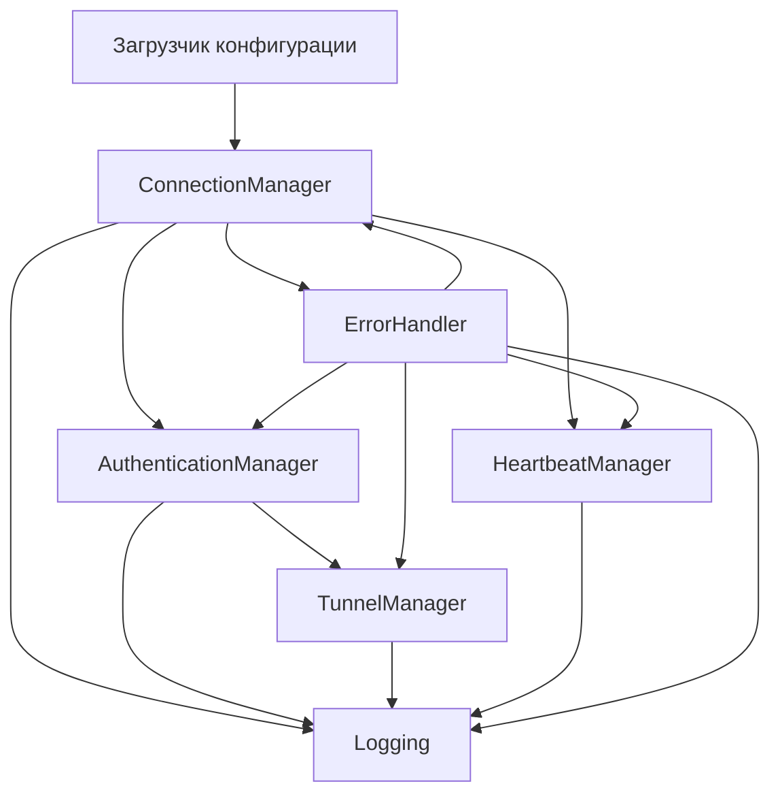

# Обзор архитектуры: CloudBridge Relay Client

## Основные компоненты

- **ConnectionManager**: Устанавливает и поддерживает защищённые соединения TLS 1.3 с сервером relay.
- **AuthenticationManager**: Обрабатывает аутентификацию через JWT и Keycloak, проверяет токены и извлекает claims.
- **TunnelManager**: Управляет созданием, валидацией и жизненным циклом туннелей (локальные/удалённые порты, проксирование).
- **HeartbeatManager**: Периодически отправляет heartbeat для контроля состояния соединения и инициирует переподключение при необходимости.
- **ErrorHandler**: Централизованная обработка ошибок, логика повторов и экспоненциальный backoff для временных ошибок.
- **Config**: Загружает и валидирует конфигурацию из YAML, переменных окружения и CLI.
- **Logging**: Структурированное логирование с настраиваемым уровнем и форматом.

## Поток данных

1. **Запуск**: Загрузка конфигурации → разбор CLI/ENV → валидация
2. **Подключение**: Установка TLS 1.3 соединения с relay
3. **Hello**: Обмен hello/hello_response (согласование протокола)
4. **Аутентификация**: Отправка JWT/Keycloak токена, получение auth_response
5. **Туннель**: Отправка tunnel_info, получение tunnel_response, запуск прокси
6. **Heartbeat**: Периодическая отправка heartbeat, обработка heartbeat_response
7. **Обработка ошибок**: При ошибке — повтор/отложенный повтор или корректное завершение

## Диаграмма взаимодействия компонентов

## Расширяемость
- Новые методы аутентификации можно добавить через AuthenticationManager
- Дополнительные типы туннелей или протоколы — через TunnelManager
- Логирование и мониторинг интегрируются через Logging

## Границы безопасности
- Весь сетевой трафик шифруется (TLS 1.3)
- Токены и секреты никогда не логируются
- Все ошибки и повторы логируются для аудита

## См. также
- `docs/README.md` — примеры использования
- `docs/API.md` — детали протокола
- `docs/SECURITY.md` — модель безопасности 